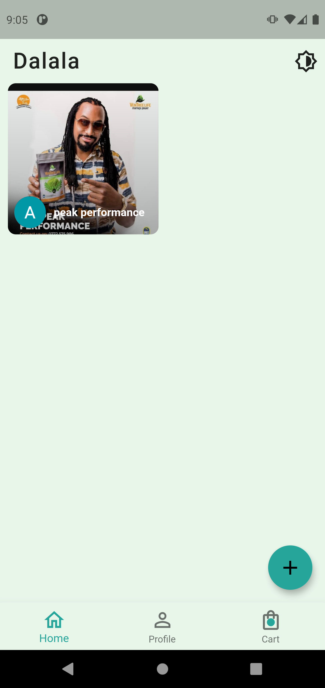
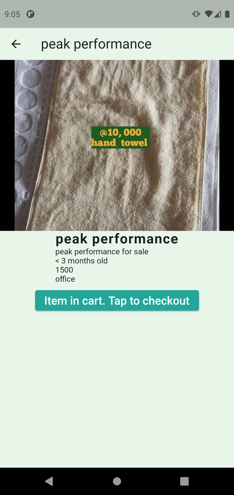
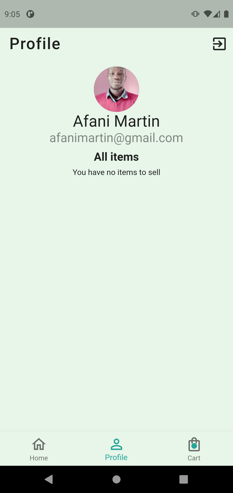
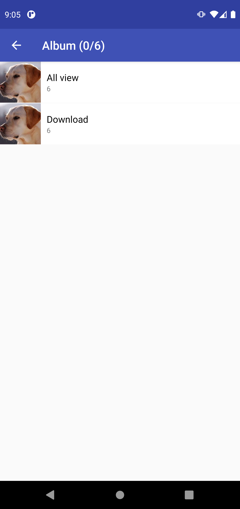
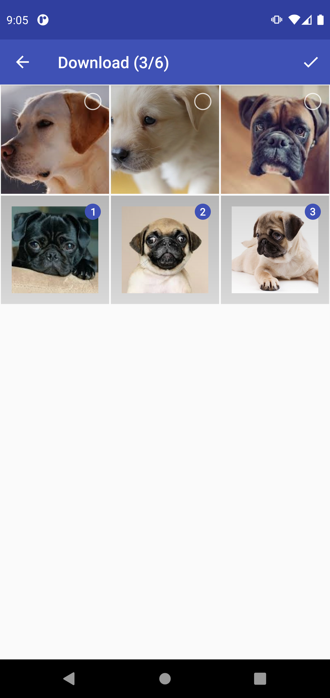
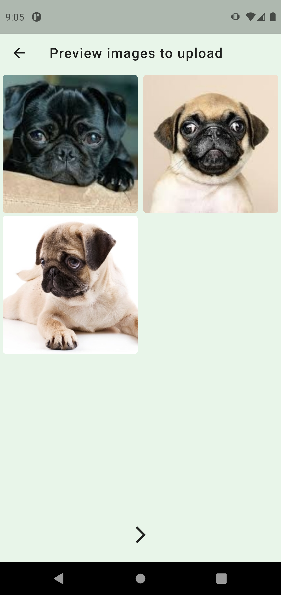
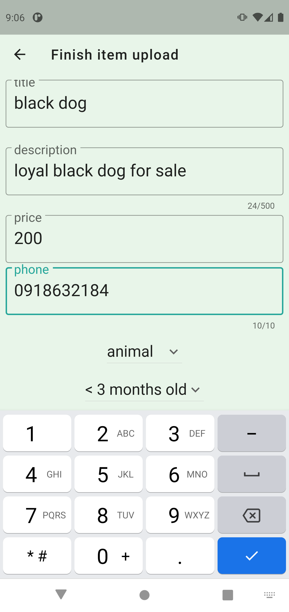
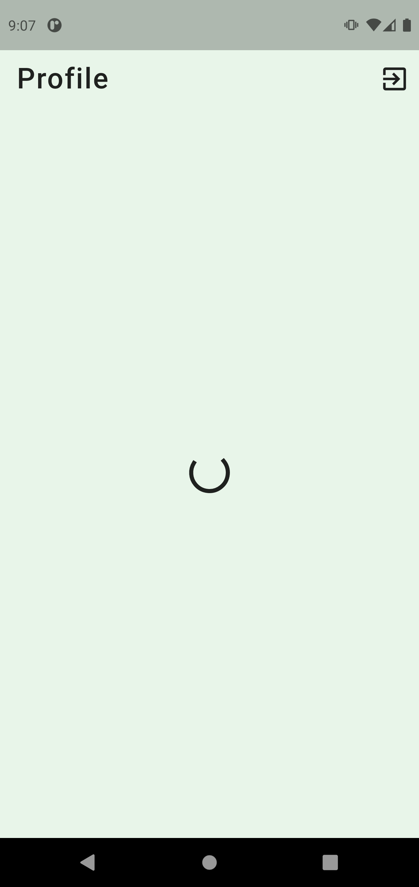
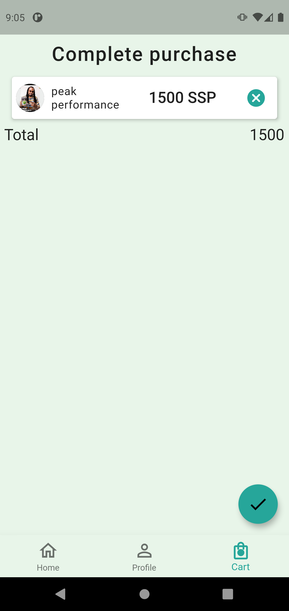

# Moostamil (means 'used' in *Arabic*)

A fun flutter app for selling/buying used items and donating items to the less privileged in the society like the refugees and street kids.

  
  
  
  
  
  
  
  
  

## Built With

- Flutter
- Flutter Bloc
- Firebase

## Getting Started
To get a local copy up and running follow these simple example steps.

### Prerequisites
- Dart SDK: install from [here](https://dart.dev/get-dart)
- Flutter: install from [here](https://flutter.dev/docs/get-started/install)

### Setup
- Clone the repo: `git clone `
- Change directory: `cd to-folder-where-app-is-cloned`
- Install dependencies: `flutter pub get`

### Usage
- `flutter run`

### Run tests
- `flutter test`

### MVP features
- login with Gmail
- upload item for sale/donataion
- donate/delete item uploaded by current user
- delete item from carts when deleted from uploads

### After MVP features
- filter items based on category
- search for items
- add local caching
- localization [ENGLISH, ARABIC]
- onboard users after signing up
- user should be able to add reviews
- user should be able to remove images during preview
- make launcher icon large enough

## Authors

👤 **Afani Martin**

- GitHub: [@afanimartin](https://github.com/afanimartin)
- Twitter: [@afanimartin](https://twitter.com/afanimartin)
- LinkedIn: [@martin-afani](https://linkedin.com/in/martin-afani/)

## 🤝 Contributing

Contributions, issues, and feature requests are welcome!

Feel free to check the [issues page](../../issues/).

## Show your support

Give a ⭐️ if you like this project!

## Acknowledgments

- [Bloc Library](https://bloclibrary.dev/#/)

## 📝 License

This project is [MIT](./MIT.md) licensed.

